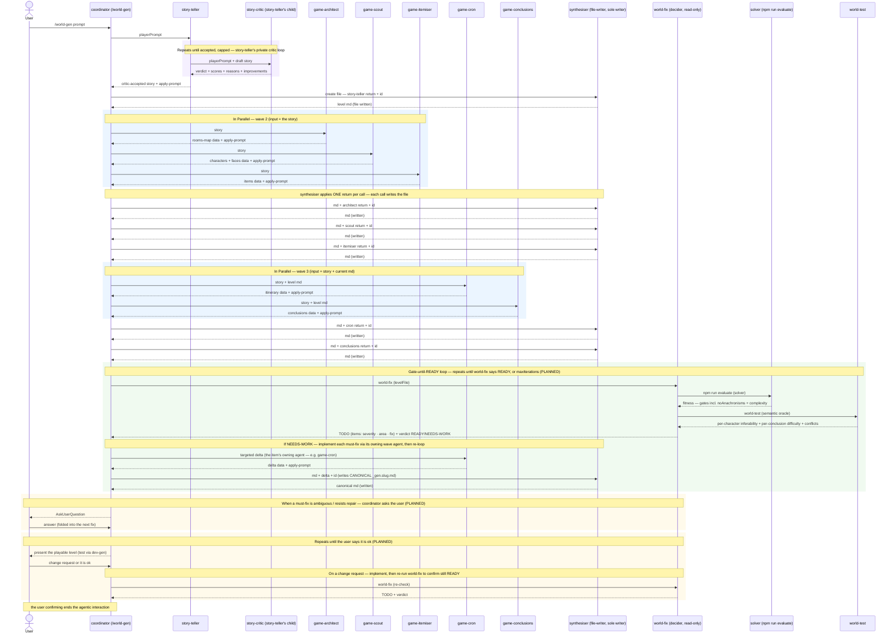
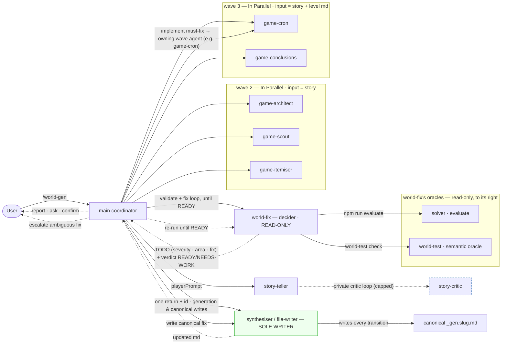
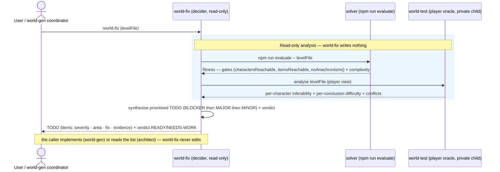
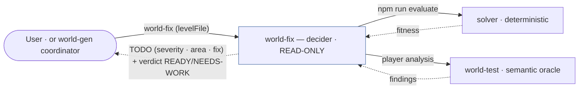

# HLD: world-gen & world-fix Agentic Call Graphs

## Status

**Living document.** Started 2026-06-14 on the `world-gen` branch. Tracks the agentic
request/delegation flow of the **two skills** that make up the generative level system — who calls whom,
what is passed and returned, which calls are LLM subagents vs deterministic steps, and which run in
parallel:

- **`/world-gen`** — the generative level *generator*: story → rooms/cast/items → itinerary/conclusions,
  then a fix loop that gates on world-fix until the level is `READY`. (It is the implementer + sole
  writer.)
- **`/world-fix`** — the read-only level *validator/decider*: runs the solver + world-test on one level
  and returns a prioritised fix TODO + a `READY`/`NEEDS-WORK` verdict. Used **standalone** by a game
  architect, and **as the gate** world-gen loops against. (It writes nothing.)

The *why* (design, fitness model, roadmap) lives in the sibling
[world-gen-generative-level-design.md](world-gen-generative-level-design.md); the exact per-agent
input/output structures live in
[../../.claude/skills/world-gen/references/agent-contracts.md](../../.claude/skills/world-gen/references/agent-contracts.md).
This document is the *how-it-calls* view of both skills.

## How to use & maintain

Keep this reflecting the **calls that actually happen** for **both skills**. **Whenever an agent call
changes — a new/removed/merged agent, a changed payload, a new delegation, a changed parallel grouping,
or a call promoted PLANNED→LIVE — update the affected skill's diagrams, its call table, and the
[Changelog](#changelog) in the same change.** Keep PLANNED visibly separate from LIVE.

## Legend

- **subagent** — a *pure* LLM agent: minimal custom input, returns a custom structure ending in a
  `prompt` field, and **never writes files**.
- **synthesiser** — the **only** agent that creates/updates the level md (applies one subagent return
  per call, writing the file each time).
- **coordinator** — the single hub (main loop). **world-fix** — a read-only *decider* sub-hub it spawns
  (calls solver + world-test, returns advice; never writes, never calls wave agents). See invariants.
- **deterministic** — a non-LLM step (a Bash/CLI call, e.g. the solver); no model.
- **LIVE** = wired in the skill today. **PLANNED** = designed, not yet wired.

**Layout convention.** The diagrams read **left → right**: a caller is always to the **left** of its
callee, so a **solid arrow is a forward request and always points rightward**. A hub's callees are
drawn to its right — and because **world-fix** is itself a (read-only) hub that calls the solver and
world-test, **its oracle callees are drawn to its right** (distinct nodes from the coordinator's). The
coordinator implements world-fix's TODO by re-calling the **wave agents + file-writer** (already on its
right) and re-running world-fix. **Dashed arrows** are returns, escalations, or human-facing prompts
back toward a hub/the user (rightward replies are the hub passing data down). Parallel groups and loops
are shown as **shaded regions with a full-English label** — no bare Mermaid keyword tabs
(`par`/`loop`/`opt`).

---

## Communication rules (invariants)

1. **Hub-and-spoke; no lateral calls.** Subagents are invoked by, and return to, a coordinator. **No
   subagent calls a sibling subagent** — no peer/`subagent↔subagent` edges. All cross-cutting
   coordination flows through a coordinator. The graph stays a **tree**.
2. **One hub + read-only decider sub-hub (DR-019).** The **main coordinator** is the only hub — it spawns
   subagents and is the sole implementer (it calls the wave agents and the file-writer). **world-fix** is
   a sub-hub it spawns, but a **read-only decider**: world-fix calls only the solver + world-test and
   returns a fix TODO + verdict — it **never writes and never calls the wave agents**. The coordinator
   then implements world-fix's TODO and re-runs it (gate-until-`READY`). Subagents may also have their
   own private deeper helpers — the **story-teller → story-critic** loop (below) and **world-fix →
   world-test** are the realized cases of vertical sub-delegation (DR-011).
3. **The synthesiser is the sole writer (DR-012).** Subagents are *pure* — they return data + an apply
   `prompt`; only the synthesiser creates/updates `public/levels/_gen.<slug>.md`. It applies **one**
   subagent return per call and **writes the file every call**, so every transitional state is
   testable live via `npm run dev-gen`.
4. **Independent subagents run in parallel (DR-013).** Subagents that need the *same* input (and not a
   prior modified md) are spawned concurrently; the synthesiser then applies their returns **one at a
   time** (serialized writes).
5. **Human-in-the-loop terminates the run (DR-014/DR-019).** The coordinator caps the fix loop (it keeps
   implementing world-fix's TODO until `READY` or `maxIterations`); final termination is the human's: the
   user tests each written state and the interaction ends only when they confirm ("it's ok").

---

## world-gen — request flow

The full generation pipeline (waves 1–3) followed by the world-fix gate loop. `world-fix` appears here
as the decider the coordinator calls; its own internals are detailed in the **world-fix** section below.

## world-gen — delegation graph

---

## world-gen — call table

| # | Caller | Callee | Kind | Sends | Returns | Parallel? | Status |
|---|---|---|---|---|---|---|---|
| 1 | User | main coordinator | invocation | player prompt | report / confirm prompt | — | LIVE |
| 2 | coordinator | story-teller | subagent | `playerPrompt` | `story` + apply-prompt | solo (wave 1) | LIVE |
| 2a | story-teller | story-critic | subagent (**private child**) | `playerPrompt` + draft story | verdict + scores + reasons + improvements | looped (capped) | LIVE |
| 3 | coordinator | synthesiser | synthesiser | md(null) + story-teller return + id | level md (writes file) | serialized | LIVE |
| 4 | coordinator | game-architect | subagent | `story` | rooms/map data + prompt | **In Parallel (wave 2)** | LIVE |
| 5 | coordinator | game-scout | subagent | `story` | characters/faces data + prompt | **In Parallel (wave 2)** | LIVE |
| 6 | coordinator | game-itemiser | subagent | `story` | items data + prompt | **In Parallel (wave 2)** | LIVE |
| 7 | coordinator | game-cron | subagent | `story` + level md | itinerary data + prompt | **In Parallel (wave 3)** | LIVE |
| 8 | coordinator | game-conclusions | subagent | `story` + level md | conclusions data + prompt | **In Parallel (wave 3)** | LIVE |
| 9 | coordinator | synthesiser | synthesiser | md + one subagent return + id | level md (writes file) | once per return (serialized) | LIVE |
| 10 | coordinator | **world-fix** (decider — own skill) | subagent (read-only) | `levelFile` | TODO `items:[{severity, area, issue, fix, evidence}]` + verdict `READY`/`NEEDS-WORK` + raw solver/world-test | per fix-loop pass | PLANNED |
| 11 | world-fix | `npm run evaluate` (solver) | deterministic | candidate file | fitness JSON (gates incl. `noAnachronisms` + complexity) | — | PLANNED |
| 12 | world-fix | world-test | subagent (semantic oracle) | candidate file | structured per-character inferability + per-conclusion difficulty + conflicts | — | PLANNED |
| 13 | coordinator | owning wave subagent (per item `area`) | subagent | the TODO item's directive (e.g. co-presence / anachronism → game-cron) | delta data + prompt | per must-fix item | PLANNED |
| 14 | coordinator | file-writer (synthesiser) | synthesiser | **canonical** md + delta + id | canonical md (writes `_gen.slug.md`, each transition) | once per fix | PLANNED |
| 15 | coordinator | world-fix | subagent (read-only) | `levelFile` (re-check) | TODO + verdict — loop until `READY` or maxIterations | per pass | PLANNED |
| 16 | coordinator | Human | `AskUserQuestion` | question (ambiguous / unrepairable must-fix) | answer / "it's ok" (ends run) | — | PLANNED |

---

## world-fix — request flow

`world-fix` is the **read-only decider**, invoked the **same way** whether a game architect runs it
standalone (`/world-fix <level>`) or the world-gen coordinator calls it as its gate. It calls only the
solver and world-test and returns advice — it **never writes and never calls the wave agents**.

## world-fix — delegation graph

## world-fix — call table

| # | Caller | Callee | Kind | Sends | Returns | Status |
|---|---|---|---|---|---|---|
| F1 | User (standalone) · or world-gen coordinator | world-fix | skill / subagent (**read-only**) | `levelFile` (mandatory) | TODO `items:[severity, area, issue, fix, evidence]` + verdict `READY`/`NEEDS-WORK` + raw solver/world-test | LIVE (standalone skill) |
| F2 | world-fix | `npm run evaluate` (solver) | deterministic | the level file | fitness JSON (gates + complexity + anachronisms) | LIVE |
| F3 | world-fix | world-test | subagent (**private child** — vertical sub-delegation) | the level file | structured per-character inferability + per-conclusion difficulty + conflicts | LIVE |

These same three calls appear inside the **world-gen** call table (rows 10–12) when world-gen uses
world-fix as its gate; there they are `PLANNED` because world-gen runs the whole loop inline today. As a
**standalone** skill, world-fix is `LIVE` — it writes nothing, so it is safe to run on any level.

---

## Current-state notes

- **Only the synthesiser writes.** Every other agent is pure (data + apply-`prompt`); the synthesiser
  resolves cross-references (owner→character id, `activeCharacter`→id, cloze answer→title) as it
  applies each return, and writes the file each call. See
  [agent-contracts.md](../../.claude/skills/world-gen/references/agent-contracts.md).
- **Vertical sub-delegation (now used).** The story-teller runs a private **story-critic** loop (its
  own child, capped) before returning — the first realized vertical sub-delegation. The critic is pure
  (scores + advice; no file writes) and is invisible to the coordinator.
- **Parallel groups.** Wave 2 = {architect, scout, itemiser} (all take only the `story`); wave 3 =
  {cron, conclusions} (both take `story` + the integrated md, neither depends on the other). story-
  teller is solo (root). The synthesiser is inherently **serialized** (one return per call).
- **world-fix is the decider — its own read-only skill (DR-019, supersedes the validator-coordinator).**
  `world-fix` scores a level with **both** oracles (solver + the **world-test** semantic subagent) and
  returns a **prioritised fix TODO** (`items:[{severity, area, issue, fix, evidence}]`) + a verdict
  `READY`/`NEEDS-WORK`. It **never writes and never calls the wave agents** — it only decides and advises
  (the structural+semantic analogue of the story-critic). **world-gen** is the implementer: it loops
  `world-fix → implement each must-fix via the owning wave agent → file-writer (canonical) → re-run
  world-fix` until `READY` (or maxIterations), asking the user on an ambiguous/unrepairable must-fix. The
  same skill runs **standalone** (`/world-fix <level>`) so a game architect gets a tailored fix list.
  Today the coordinator runs the loop inline; a separately-spawned world-fix agent is the next build.
- **Exercise status.** The revised model has been exercised **through waves 1–3** (Sing a Song of
  Sixpence, 2026-06-14): the story-teller→story-critic loop, the **In-Parallel** waves 2 and 3, pure
  subagent returns, and the synthesiser all ran; the level loads with the full Identities + cloze
  puzzle, and movement-based co-presence works. The far-room link that first read as an open finding was
  a **solver** blind spot (a tour's final room was never sampled), now **fixed** (DR-016): the level is
  fully solvable — **6/6 characters, 8/8 items**, `meanCost 0.60`, zero anachronisms. The **Inception**
  run (2026-06-14) then exercised the **world-fix loop** end-to-end (`--verbose`): world-fix caught a
  clobbered `# Conclusions` section + a dropped item, the coordinator fixed both and re-ran to `READY`
  (7/7 chars, 7/7 items, `meanCost 0.49`). **Not yet exercised:** a *separately-spawned* world-fix agent
  (run inline today) and the human-in-the-loop. Three Blind Mice / Tinker predate this architecture.
- **Anachronism gate (new).** The solver now also detects **timeline anachronisms** (a character in two
  places at once — an absolute arrival back-planned over an earlier one); `npm run evaluate` exposes it
  as the `noAnachronisms` gate + an `anachronisms` detail list, so **world-fix** flags such a fault with
  `area: game-cron` and world-gen routes the fix there (the itinerary owner). See DR-016 + adr-solver §6c.
- **Verbose mode mirrors this graph (DR-018).** `/world-gen --verbose` streams a **live instance of this
  call graph**: each edge here becomes a `[CALLER|CALL]` + callee `[…|IN]`/`[…|OUT]` line (indented by
  depth, parallel waves marked), plus **world-fix's reasoning** (its solver + world-test reads → diagnosis
  → the prioritised TODO + verdict) and the **coordinator's** fix loop (implement each must-fix via the
  owning wave agent + file-writer, then re-run world-fix). Off by default; exposes behaviour without
  changing it. Trace format: the skill's *Verbose / debug mode* section.
- **Synthesiser is currently fulfilled inline.** In runs so far the **coordinator performs the
  synthesiser/file-writer role itself** (writing the file as it applies each return); a *dedicated
  synthesiser agent* is the target — same status as a separately-spawned world-fix (designed, not yet a
  separate agent). The sole-writer invariant still holds: nothing but the file-writer role writes the md.

## Changelog

- **2026-06-14** — Document created (Phase-1 LIVE call graph + PLANNED world-test/optimizer/human calls).
- **2026-06-14** — Made the hub-and-spoke invariant explicit (no lateral calls; vertical sub-delegation
  allowed).
- **2026-06-14** — **Revised architecture:** subagents are now *pure* (minimal custom inputs; return
  data + an apply-`prompt`); a **synthesiser** is the sole writer of the level md (one return per call,
  writes every transition); independent subagents run in **parallel** (wave 2 = architect/scout/
  itemiser; wave 3 = cron/conclusions); a **validator-coordinator** sub-hub owns the capped solver/
  world-test tweak loop and routes human-input up to the main coordinator; the run ends on human
  confirmation. Diagrams, call table, and invariants rewritten; per-agent IO moved to
  `agent-contracts.md`. (Design doc DR-012/013/014.)
- **2026-06-14** — Added the **story-critic** (story-teller's private child): the story-teller now runs
  a capped critic loop and returns only a critic-accepted story — the first realized **vertical
  sub-delegation**. (Design doc DR-015.)
- **2026-06-14** — Exercised the revised model through **waves 1–2** (Sing a Song of Sixpence): the
  story-critic loop, parallel wave 2, and pure returns all worked; the synthesiser-applied wave-2 state
  loads. Recorded that the **synthesiser is currently fulfilled inline by the coordinator** (dedicated
  agent still pending), and that wave 3 / validator-coordinator / human-loop remain un-exercised.
- **2026-06-14** — Exercised **wave 3** (cron ∥ conclusions): the level loads with the full puzzle and
  movement-based co-presence works (depth 0.38); a far-room link is an open solver finding. Updated
  exercise status to **waves 1–3** (no un-exercised waves remain). Relabelled the parallel blocks
  explicitly **"In Parallel"** (the bare Mermaid `par` keyword stays — it's required syntax — but every
  grouping's visible label now reads "In Parallel").
- **2026-06-14** — Solver-side update (DR-016): the far-room "open finding" was a co-presence
  **sampling** blind spot, now fixed (timeline-end sample) — the level is fully solvable (6/6 chars, 8/8
  items, `meanCost 0.60`). Added the **anachronism** signal to the validator's `evaluate` return
  (`noAnachronisms` gate) and noted the fault routes to **game-cron**.
- **2026-06-14** — **Diagrams reoriented left → right.** Both the sequence and delegation diagrams now
  read caller-on-left, callee-on-right; the **validator-coordinator's callees are replicated to its
  right** (EV/PG/VR/SY2 as distinct nodes). Flowchart switched to `flowchart LR`. **Removed every bare
  Mermaid keyword tab** (`par`/`loop`/`opt`) in the sequence diagram — parallel groups and loops are now
  **shaded `rect` regions with a full-English label** ("In Parallel …", "Repeats until …", "When a fix is
  needed …"). Solid arrow = forward request (always rightward); dashed = return / escalation / human
  prompt. (Supersedes the prior "the `par` keyword stays" note.)
- **2026-06-14** — **Validator-coordinator wired as a dual-oracle accept-if-better loop (DR-017).** Both
  diagrams now show the validator scoring with the **solver and the world-test semantic oracle**, routing
  a fault to its owning agent for a **targeted delta**, writing a **scratch** `_gen.slug.try.md` via the
  file-writer, **re-checking with both oracles**, and keeping the delta only if it improves with no gate
  regression. It **returns the aggregated improvement ledger** to the coordinator (no canonical write);
  the **coordinator asks the user** on `humanQuestion`/ambiguity, then **writes the canonical md via the
  file-writer** (one accepted improvement per call). Call table rows 10–17 + the validator note updated.
- **2026-06-14** — Noted **verbose mode (DR-018)**: `/world-gen --verbose` streams a live instance of
  this call graph (every `→ CALL` / `← RET`, the validator's per-iteration reasoning, the coordinator's
  delegations). Added a current-state note; trace format lives in the skill.
- **2026-06-14** — **Validator extracted into the standalone `world-fix` skill (DR-019).** Both diagrams
  now show `world-fix` (read-only decider) calling only the **solver + world-test** and returning a fix
  **TODO + verdict** (`READY`/`NEEDS-WORK`); the **coordinator** implements each must-fix via the owning
  wave agent + file-writer and **re-runs world-fix until `READY`** (gate-until-READY, replacing DR-017's
  scratch/accept-if-better). Removed the validator-side `VR`/`SY2` scratch nodes. Call table rows 10–16,
  legend, invariants (now "one hub + read-only decider sub-hub"), and current-state notes updated.
- **2026-06-14** — **Documented BOTH skills.** Retitled to *world-gen & world-fix Agentic Call Graphs*;
  the existing diagrams are now the **world-gen** section, and a dedicated **world-fix** section was added
  with its own request-flow sequence, delegation flowchart, and call table (F1–F3) — showing world-fix
  invoked identically standalone (a game architect) or as world-gen's gate, calling only solver +
  world-test (read-only). Noted the status nuance: world-fix is `LIVE` standalone but appears `PLANNED`
  inside world-gen's inline loop.
- **2026-06-14** — Renamed the **`play-game` skill → `world-test`** (the player/semantic oracle) for a
  consistent **world-gen · world-fix · world-test** family. Both diagrams + call tables now show
  `world-test` (id `PG`) as the semantic oracle world-fix calls; all prose references updated. Pure
  rename — no call-graph change.
